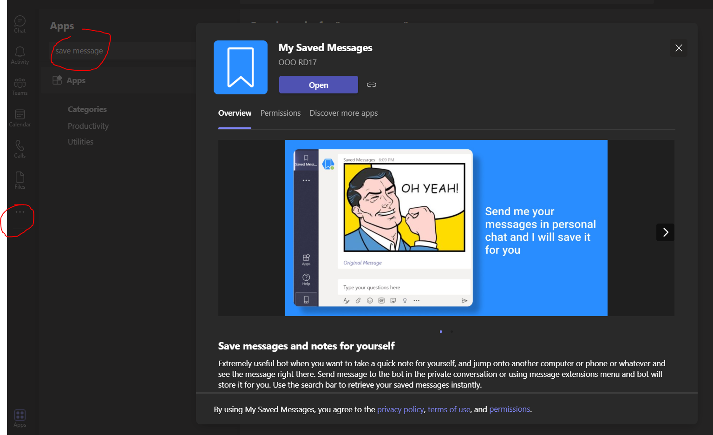
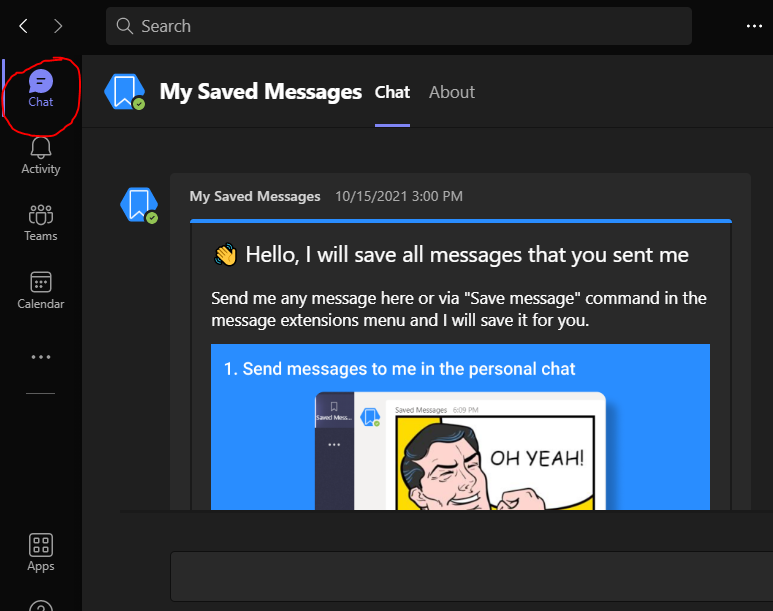

# MS-Teams-Trick
This repo is a note for MS Teams Trick

## Jump to a conversation when searching messages
Hi, if you guys are looking for a feature like "Goto the conversation" or "Show full conversation" or something like that, sadly MS Teams does not have that kind of feature.

Maybe, in the recent update, MS Teams has updated its features and maybe you can be able to show the full conversation or maybe not and it depends on the cache (it means, you cannot see a full conversation if the messages are too old - few months or years)

But don't worry I have found a solution for this kind of frustration, let's dive in

1. Goto MS Teams App: left menu side, click on `...` and search for `Save message`

2. Install this App and this should be in your `Chat` 

3. Find the message that you want, and then click on the `...` right next to your desired message -> `More actions` -> `Save Message`. 

This way, your message will be saved on the `My Saved Messages` App

4. Goto `Chat` -> `My Saved Messages` -> Select the message that you want to jump -> Click on `Original Message` and Voila!!!

